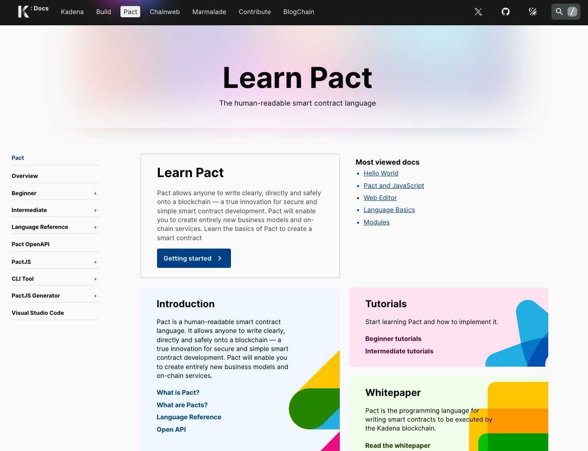
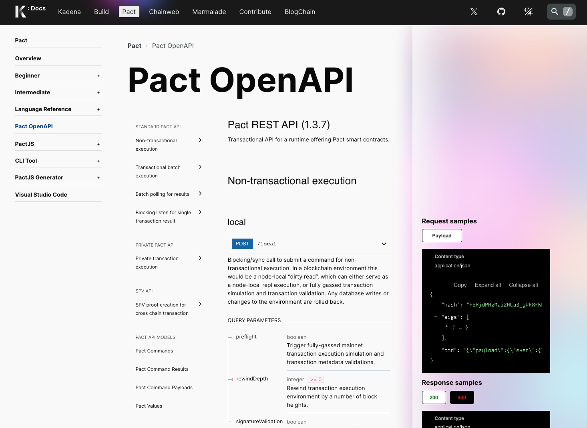
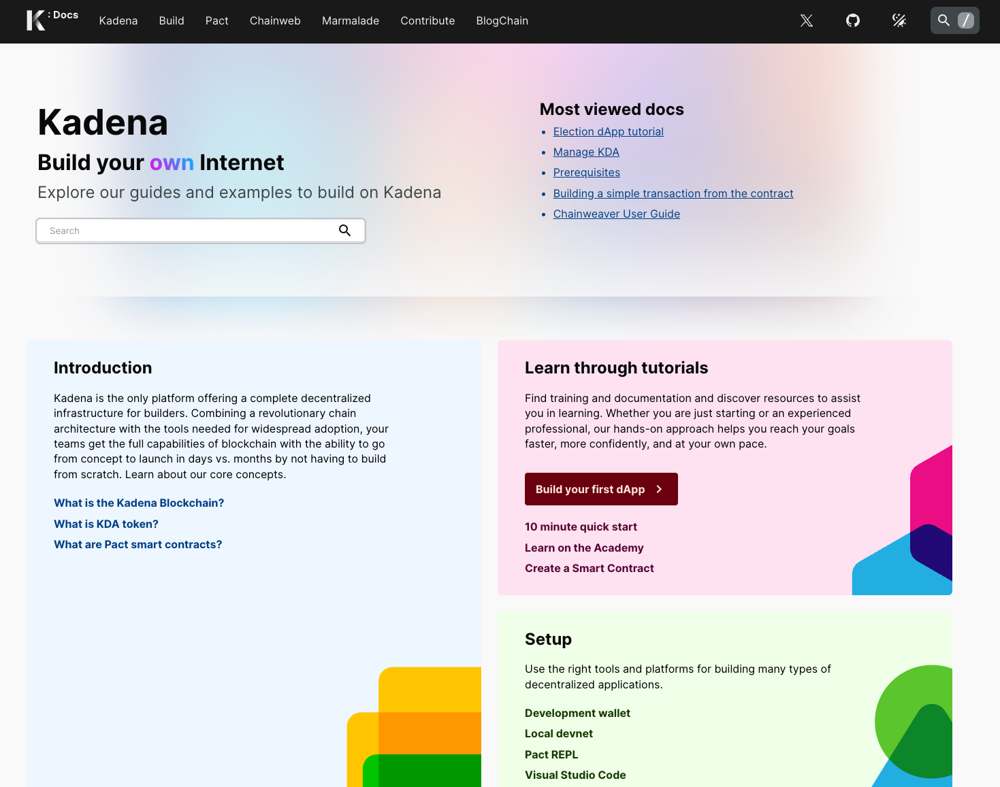

We encourage everyone with an interest in improving Kadena documentation to contribute content, submit issues, and suggest changes.
This guide describes how you can make changes to the documentation website directly by editing source files or indirectly by requesting updates.
You can follow these instructions whether you are an internal or external contributor.

## Prerequisites

Before you begin, verify that you meet the following basic requirements:

- You have a code editor, a GitHub account, and experience using command-line programs, including `git` commands and command line options.
- You are familiar with using the Markdown markup language to add formatting elements to plain text documents. 
  For information about using Markdown, see the [Markdown Guide](https://www.markdownguide.org/).

- You have the `pnpm` package manager installed.
  
  Depending on your development environment, you can install `pnpm` using a standalone script or using a package manager.
  For example, you can run the command `brew install pnpm` or `npm install --global pnpm` to install `pnpm` on your local computer.
  For more information about installing `pnpm` on different operating systems, see [Installation](https://pnpm.io/installation).
  
  Run `pnpm --version` to verify that you have `pnpm` installed and the version you are running. 

## Set up a local development environment

To set up a local development environment for contributing to Kadena documentation:

1. Open a terminal shell on your computer.

1. Clone the `kadena-js` repository by running the following command:

   ```code
   git clone https://github.com/kadena-community/kadena.js.git
   ```

   This command clones the entire public repository for the TypeScript and JavaScript tools that enable you to interact with the Kadena ecosystem, including the documentation package.

2. Change to the root of the `docs` directory by running the following command:
   
   ```code
   cd kadena.js/packages/apps/docs
   ```

3. Install the documentation package dependencies by running the following commands:

   ```code
   pnpm install
   ```

   This command installs all of the package dependencies used to build the documentation website and provide basic features, like navigation and search functionality.
   To contribute to documentation, you typically only need to work in the `/src/pages` folder and its subfolders.
   Most of the sub-folders and files in the `/src/pages` folder define the structure and operation of the application.
   For example:

   - `/api` contains scripts to interact with the website using REST API calls.
   - `/authors` contains scripts to capture blog post authors.
   - `/blogchain` maintains the archive of blog post articles.
   - `/build` contains sub-folders and Markdown files with information for builders.
   - `/chainweb` contains a script to include Chainweb documentation that is generated automatically in the website.
   - `/contribute` contains documentation related to community activities.
   - `/help` contains a placeholder for displaying help topics.
   - `/kadena` contains sub-folders and Markdown files with information about Kadena, including core concepts and terminology.
   - `/marmalade` contains sub-folders and Markdown files with information about Marmalade, including architecture and metadata.
   - `/pact` contains sub-folders and Markdown files with information about the PACT language, including tutorials, examples, and reference.
   - `/search` contains the script used to search for information in the application.
   - `/tags` contains scripts to capture blog post tags.
   
   Within these folders, the Markdown files—files with the `md` or `mdx` extension—contain the documentation content.
   After you explore these folders, create a local working branch of the repository for your contribution.

4. Create a local branch with a prefix that identifies you as the author and a branch name that describes the content you intend to add or change.
   For example, if your git handle is `lola-pistola` and you are fixing a typo in the kadena folder, you might create a branch like this:

   ```code
   git switch -c lola-pistola/typo-kadena-kda-concepts
   ```
   
## Start a local development server

As you make changes to the content in your local branch, it's helpful to see how the changes will be 
rendered when the documentation is published.

You can use `pnpm dev` to run a local development server that detects changes to the documentation and displays them automatically in the browser.

To start the development server in your local environment:

1. Change to the React component library by running the following command:
   
   ```code
   cd kadena.js/packages/libs/react-ui
   ```

1. Build the component library locally by running the following command:
   
   ```code
   pnpm build
   ```

1. Change your current working directory to `kadena-js/packages/apps/docs`.
   
   ```code
   cd ../../apps/docs
   ```

2. Start the development server by running the following command:
   
   ```code
   pnpm dev
   ```

3. Open a web browser and navigate to the documentation using the URL `localhost:3000/docs`. 

## Adding a new page

You can add a new page anywhere in the `src/pages` folder to add a topic to the structure of the information architecture.
You can build a navigational structure up to three levels deep.

The top navigation header is constructed from folders in the `src/pages` folder.
Currently, the top navigation has the following top-level sections:

- Kadena
- Build
- Pact
- Chainweb
- Marmalade
- Contribute
- BlogChain

Quick start > Brief intro to Hello, World! to navigating the documentation:
Engage > Learn > Concepts
Onboard > Discover > Tutorials (guided journey)
Coach > Build > Guides > How-to (task-based scenarios)
Propel > Advance > Deeper dives and reference

Create a `.md` file. The name of the file is also the name of the URL. Make it a
good one. Best is to make it the title of the document. For `spaces`, please use
`-`. Correct file name:

- `new-docs-application.md`
- `new-version-pact.mdx`

Incorrect file name:

- `newDOCSApplication.md`
- `new_pact_version.ts`
- `language reference.tsx`

### Frontmatter

Every `.md` file should start with some meta data about the document. This is
called the frontmatter. For the docs application it looks something like this:

```yaml
---
title: New docs application
subTitle: It's new!
description: The new documentation website is better than ever
menu: New docs
label: New docs
editLink: https://github.com/kadena-community/kadena.js/edit/main/packages/tools/cookbook/README.md
publishDate: 1977-10-13
headerImage: /assets/blog/2020/1_b97oiC8M_ePx83B-PW0Cfg.webp
author: He-man
authorId: h.man
layout: blog
---
```

Lets go over them 1 by 1.
`title`: the title of the document
`subTitle`: not required. Only used when on landing page layout. `description`:
a short description on what the page is about. This will be used as meta data
for SEO, but can also be used as an excerpt in the search results.
`menu`: the name used in the side or header menu's.
`label`: the name used in the breadcrumbs.
`editLink`: this is the place where the actual document lives. This particular
`md` file has been imported from somewhere else. The editlink is used at almost
every page, at the bottom. It will show a link to everyone visiting the page.
And they can create a PR with changes. `publishDate`: not required. only used
for blogchain, at the moment. And used to show the user what date the article
was first published.
`headerImage`: not required. only used for the blogchain as the main header on
top of the article.
`author`: _depricated_! not required. for blogchain we used to JUST show the
author name.
`authorID`: not required. replaced the above `author` field. The ID then reads
the author info from the `./src/data/authors.json`
`layout`: checks what layout the page will use to show the data.
`tags`: not required. An Array of strings that clarify what the content is
about. It is shown on blogchain pages, but is also used in the search indexing
to get better search results.

### Edit link

For the documentation website we want the community to help out. It would be
great if they help out improving the documentation. Whether it is spelling
mistakes or clarifying sections.
The `editLink` frontmatter property, when available, will show an `edit page`
button at the bottom of the screen. This will send the user to the appropriate
github repo page where they can edit and create a PR with their changes. The
`editLink` will be added to the frontmatter on runtime or, when the doc is
imported from outside the package, it will be added during import.

### Assets

Assets like images can be saved in the following folder `/public/assets`.
You can make as many subfolders as you see fit.

### H1

Every page's content should also start with an `h1` header.
If the `h1` header does not exist, the build scripts will give you a warning.

### Layout

There are a couple of different layouts that can be used in the application.
`full`, `landing`, `blog`, `home` and `redocly`.

#### Full layout

 Most pages will use this layout.
It has the left sidemenu and a table of content on the right. And it has the
most room for the actual content.

#### Landing layout

 If a section needs a special
page landing page, to give it a bit more visibility we can use the landing
layout.
It has a large header that uses the `title` and `subTitle` from the frontmatter.

#### Blog layout

 This layout is actually only used
for blog posts. It shows the large `headerImage` from the frontmatter, if
available.
It also shows the author info and `tags` from the frontmatter, if available.
Itdoes not have any sidemenus.

#### Redocly layout

 Only used for pages that show
swagger API info. Not to be used for other documentation.

#### Home layout

 The `home` layout is not really
used together with `md` files. It is only used for landing pages of sections and
the actual home page.
It has a header that needs to be custom made for that page and we can do with
the rest of the layout what ever we want.

## Moving pages around

Moving a page to another place in the tree is as simple as moving a file
somewhere inside the `src/pages` directory.
When the build then runs it is automatically is put in the correct position.
**Important:**

- Renaming a file will ALSO change the URL.
- It could be that some internal links are now broken. You will get a warning
  from the build scripts.
- It could be that some external websites were linking to this page and will now
  get a 404.
  - Please check analytics how many visits does this page get?
  - If the page gets a lot of visits you can at a 301 redirect in
    `next.confing.mjs`.
    This will redirect all the old links to the new URL.

## Imported docs

Most of the documentation files live in the docs package and can be editted in
place as described. But there are also documentation files that live outside of
this package and are maintained in other packages or repos. These are then
imported and copied in their correct position during build time.
If you have ran the build script once you can see them in your `src/pages` tree.
If you make changes in these files they will be over written the next time you
make a build.

So how do you know if this is an imported file and how can you make changes to
them? In these files there will be a frontmatter property called `editLink`.
When this property exists, this means that this is an imported document. And the
link will be the place where you can edit this particular file.

### Multipage import

Some docs, that are imported, are enourmously lengthy pages that are just to big
to show on 1 page. There we can say, during the import, that it needs to be
broken up. This is done automatically by checking `h2` headers. Every `h2`
header will now be the start of a new page.
The `editLink` frontmatter prop is the same for all these pages.

## Checking documentation validity

To check that all the files are valid and ready to build, but you don't want to
run the complete build run:

```bash
pnpm build:scripts
```

## Build scripts

There are a couple of build scripts running just before the site is put live.
These scripts help us with importing some docs, identifying issues with the
markdown files etc.

`importAllReadmes.mjs`
This script will import some documentation from other packages of this repo.

`createDocsTree.mjs`
This will create a large `json` file with the complete menu structure of the
whole app, together with some extra meta data. This file is super useful in the
app. For instance in finding the next and previous page, so we can use that at
the bottom of the page for easy navigation.

`createSpecs.mjs` This creates the `json` files for the swagger-like pages for
pact and chainweb api documentation.

`detectBrokenLinks.mjs` This will walk through all the documentation and check
all the internal links. To check if they are pointing to an actual file. This
will prevent 404's in our page when documentation is removed or moved to a
different menu/folder.
It will also check for certain domains that are not allowed anymore. Think about
`pact-language.readthedocs.io` or `medium.com/kadena-io`. Also it will rename
some links (from documentation that was imported) from https://docs.kadena.io to
internal links.

`checkForHeaders.mjs`
Checks that every page uses at least an h1 header at the top of the page.
Important for SEO.

`checkAuthors.mjs`
Blog posts have author information. This script checks that this author
information is valid for our website.

`createSitemap.mjs`
Creates a sitemap of all the pages and creates a `sitemap.xml`.
This file is later imported by search engines to know what is needed to be
craweled. Important for SEO.

`copyFavIcons.mjs`
copy all the fav icons from `/common/images/icons` package in the monorepo.

## Cli

The CLI is a TODO.

- bootstrap a page
- run build scripts more fine-grained (only the import scripts for example)
- can we do something like 'docs-prettier'?

## Adding issues

If there are any issues with the docs, or you see room for improvements, you can add
stories to: https://github.com/kadena-community/kadena.js/issues
